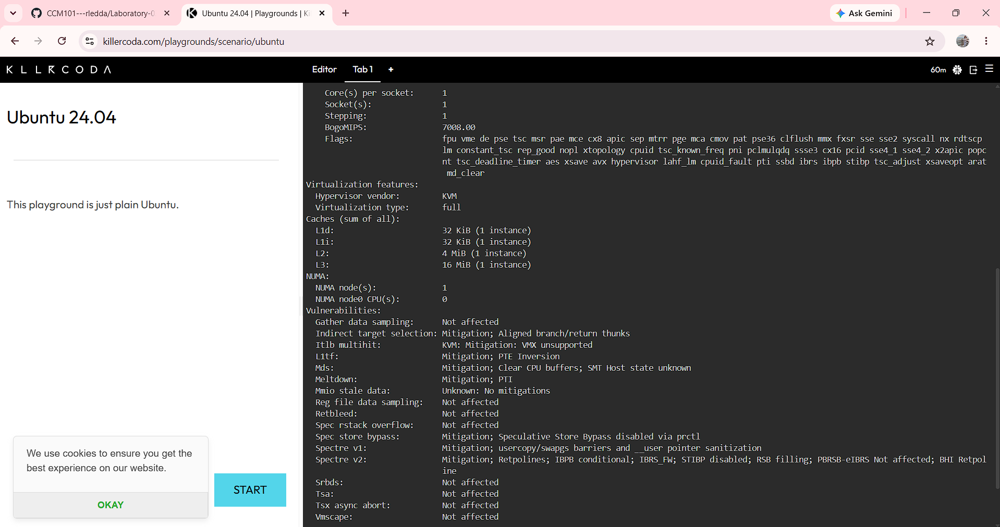

# Laboratory 3 — Multi-Cloud Explorer

## Checkpoint 7 — KillerCoda Server Investigation

The KillerCoda Linux environment was investigated using standard Linux commands to identify its operating system, CPU, memory, and disk space.

### Linux Server Information

| Category | Result |
|---|---|
| Operating System | Ubuntu 24.04.4 LTS (Noble Numbat) |
| Architecture | x86_64 |
| CPU | Intel Xeon E312xx |
| CPU Cores | 1 |
| Memory | 1.9 GiB RAM |
| Disk Space | 19 GiB total |
| Disk Used | 5.4 GiB |
| Disk Available | 13 GiB |

### Linux Commands Used

```bash
cat /etc/os-release
lscpu
free -h
df -h /
```

### Possible Cloud Services

If this Linux server were migrated to a public cloud, it could be hosted using virtual machine services from the three major cloud providers:

- **AWS:** Amazon EC2
- **Microsoft Azure:** Azure Virtual Machines
- **Google Cloud:** Compute Engine

These services provide virtual machines that can run Linux-based operating systems and applications.

### Checkpoint 7 Evidence



*Figure 1. KillerCoda terminal showing the Linux server investigation commands and results.*
