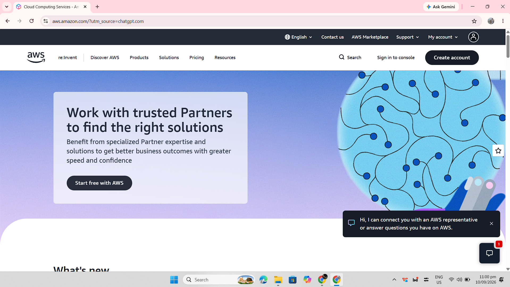

# AWS Research

## Brief Overview

Amazon Web Services (AWS) is a cloud computing platform provided by Amazon. AWS offers cloud services for computing, storage, databases, networking, security, analytics, and many other technology needs. AWS began offering infrastructure services in 2006 and uses a pay-as-you-go cloud model.

## Global Infrastructure

AWS organizes its global infrastructure into geographic Regions and Availability Zones. A Region is a separate geographic area, while Availability Zones are isolated locations within a Region. Using multiple Availability Zones can help applications improve availability, fault tolerance, and scalability.

## Cloud Management Console

The AWS Management Console is a web-based interface used to access and manage AWS services and resources. Users can use the console to create and configure cloud resources, monitor services, and manage their AWS environment.

## Four Core Services

### 1. Amazon EC2

Amazon Elastic Compute Cloud (EC2) provides virtual servers in the AWS cloud. Organizations can use EC2 to run applications and other computing workloads.

### 2. Amazon S3

Amazon Simple Storage Service (S3) is an object storage service used to store and retrieve files, backups, media, and other types of data.

### 3. Amazon RDS

Amazon Relational Database Service (RDS) is a managed relational database service. It helps organizations set up, operate, and scale relational databases without managing all of the underlying infrastructure.

### 4. AWS IAM

AWS Identity and Access Management (IAM) is used to manage access to AWS resources. It allows administrators to control users, roles, permissions, and access policies.

## Three Advantages

1. AWS provides a broad range of cloud services for different technical and business requirements.
2. AWS infrastructure can support applications that require scalability and high availability.
3. Cloud resources can be provisioned on demand, reducing the need for organizations to purchase and maintain physical infrastructure themselves.

## Typical Enterprise Use Cases

Organizations use AWS for application hosting, data storage, database management, backups, software development, analytics, and other business workloads. AWS provides services across computing, storage, networking, security, databases, artificial intelligence, and many other categories.

## Screenshot Evidence

*Figure 1. AWS official homepage.*

## Sources

- AWS Overview: https://docs.aws.amazon.com/whitepapers/latest/aws-overview/introduction.html
- AWS Global Infrastructure: https://aws.amazon.com/about-aws/global-infrastructure/
- AWS Regions and Availability Zones: https://docs.aws.amazon.com/global-infrastructure/latest/regions/aws-regions-availability-zones.html
- AWS Documentation: https://aws.amazon.com/documentation-overview/
