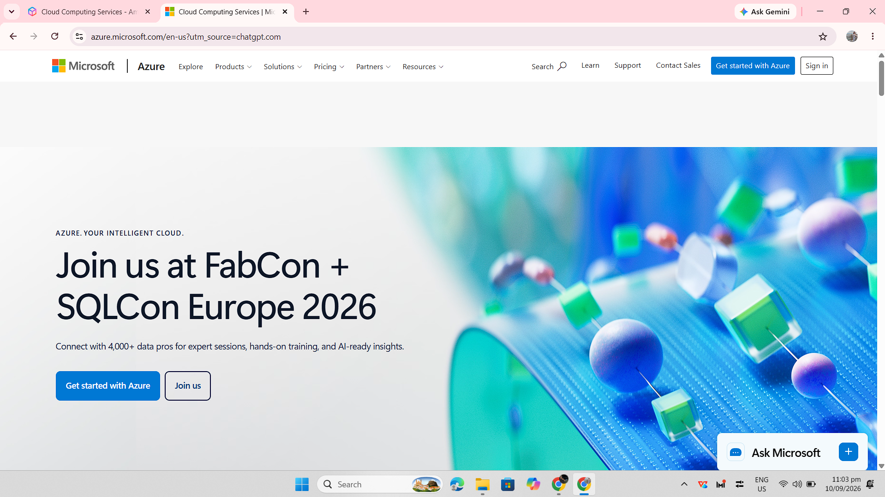

# Microsoft Azure Research

## Brief Overview

Microsoft Azure is a cloud computing platform developed by Microsoft. It provides services for computing, storage, databases, networking, security, analytics, artificial intelligence, and application development.

## Global Infrastructure

Azure operates through a worldwide infrastructure of geographic regions and datacenters. Organizations can select appropriate regions when deploying resources based on factors such as location, performance, availability, and regulatory requirements.

## Cloud Management Console

The Azure portal is a web-based management interface for Microsoft Azure. It allows users and administrators to create, configure, monitor, and manage Azure resources and services through a graphical interface.

## Four Core Services

### 1. Azure Virtual Machines

Azure Virtual Machines provide virtualized computing resources for running applications and operating systems in the cloud.

### 2. Azure Blob Storage

Azure Blob Storage is an object storage service used to store large amounts of unstructured data such as documents, images, videos, backups, and application files.

### 3. Azure SQL Database

Azure SQL Database is a managed relational database service based on Microsoft SQL Server technology. It reduces the amount of infrastructure management required for database workloads.

### 4. Microsoft Entra ID

Microsoft Entra ID is Microsoft's cloud-based identity and access management service. It helps organizations manage identities and control access to applications and resources.

## Three Advantages

1. Azure provides strong integration with Microsoft's technologies and enterprise products.
2. Azure offers a wide range of services for computing, storage, databases, networking, security, and application development.
3. Organizations can scale cloud resources according to their workload and business requirements.

## Typical Enterprise Use Cases

Organizations use Azure for application hosting, virtual machines, databases, file and object storage, identity management, analytics, software development, and hybrid cloud environments. Azure is particularly useful for organizations that already use Microsoft technologies.

## Screenshot Evidence

*Figure 1. Microsoft Azure official homepage.*

## Sources

- Microsoft Azure: https://azure.microsoft.com/
- Azure Documentation: https://learn.microsoft.com/azure/
- Azure Global Infrastructure: https://azure.microsoft.com/en-us/explore/global-infrastructure/
