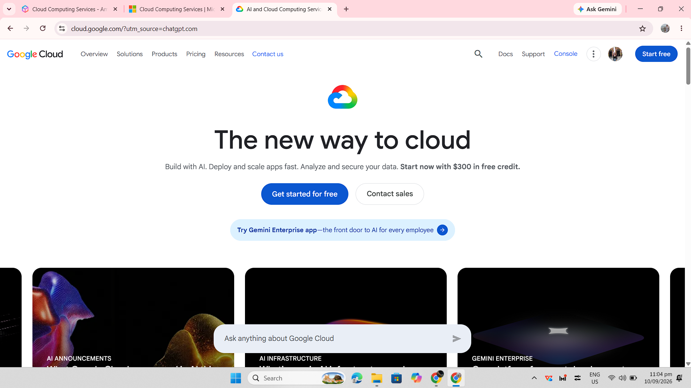

# Google Cloud Platform Research

## Brief Overview

Google Cloud Platform (GCP), also known as Google Cloud, is a cloud computing platform provided by Google. It offers services for computing, storage, databases, networking, artificial intelligence, machine learning, data analytics, and application development.

## Global Infrastructure

Google Cloud operates a global infrastructure organized into regions and zones. Regions represent geographic areas, while zones are deployment areas within those regions. This structure helps organizations deploy applications across different locations and design systems for availability and reliability.

## Cloud Management Console

The Google Cloud Console is a web-based interface used to manage Google Cloud resources and services. Users can create and configure resources, monitor applications, manage projects, and control access through the console.

## Four Core Services

### 1. Compute Engine

Compute Engine provides virtual machines that organizations can use to run applications and other workloads on Google's infrastructure.

### 2. Cloud Storage

Cloud Storage is an object storage service used to store and retrieve data such as files, backups, media, and application data.

### 3. Cloud SQL

Cloud SQL is a managed relational database service that supports database systems such as MySQL, PostgreSQL, and SQL Server.

### 4. Google Kubernetes Engine

Google Kubernetes Engine (GKE) is a managed Kubernetes service used to deploy, manage, and scale containerized applications.

## Three Advantages

1. Google Cloud provides strong capabilities for artificial intelligence, machine learning, and data analytics.
2. Google Cloud provides managed services that can simplify application development and infrastructure management.
3. Its global infrastructure allows organizations to deploy applications across multiple geographic locations.

## Typical Enterprise Use Cases

Enterprises use Google Cloud for application hosting, data analytics, artificial intelligence and machine learning, containerized applications, database management, data storage, and large-scale digital services.

## Screenshot Evidence

*Figure 1. Google Cloud official homepage.*

## Sources

- Google Cloud: https://cloud.google.com/
- Google Cloud Documentation: https://cloud.google.com/docs
- Google Cloud Locations: https://cloud.google.com/about/locations/
